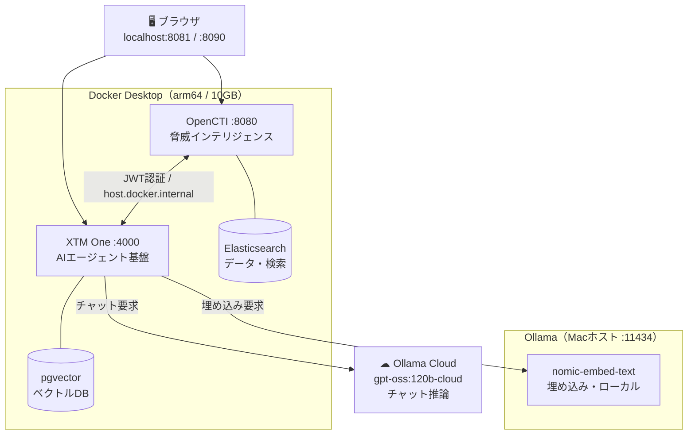

# OpenCTI × Ollama ローカル AI 連携 セットアップ記録

作成日: 2026-07-17

---

## 1. 環境

- マシン: Mac（Apple Silicon / arm64）、物理メモリ 16GB
- Docker Desktop: メモリ割当 10GB
- 対象: OpenCTI `7.260710.0`（**XTM Suite** 構成）
  - **OpenCTI** … 脅威インテリジェンス基盤
  - **XTM One** … AI エージェント基盤
  - **xtm-composer** … 連携（integration）管理
- LLM: **Ollama**（ホスト稼働）＋ Ollama Cloud

---

## 2. 用語

- **ES (Elasticsearch)**: OpenCTI のデータ格納・検索エンジン。
- **seccomp**: Linux カーネルのシステムコール制限機能。ES 起動に必要。
- **arm64 / amd64**: CPU アーキテクチャ。Apple Silicon は arm64。
- **OOM (Out Of Memory)**: メモリ不足による強制終了。
- **EE (Enterprise Edition)**: OpenCTI の有償版。AI 機能に必須。
- **XTM One**: Filigran 製の AI オーケストレーション層。OpenCTI の AI を駆動する。
- **エージェント**: XTM One 上で動く AI アシスタント（例: CTEM Assistant）。
- **埋め込み (embedding)**: 文章をベクトル化し意味検索を可能にする仕組み。
- **RAG**: 保存データを検索して LLM の回答根拠にする手法。
- **JWT**: 署名付き認証トークン。issuer（発行者）と audience（宛先）を持つ。
- **host.docker.internal**: コンテナからホストを指す特別なホスト名。

---

## 3. やったこと（問題 → 対処）

### 3-1. ES が起動しない（arm64 / seccomp）
- 症状: `seccomp unavailable` で ES が起動失敗。
- 原因: `DOCKER_DEFAULT_PLATFORM=amd64` で ES が amd64 エミュレーション起動。エミュレーション下は seccomp 不可。
- 対処:
  - 環境変数は使わない。
  - `docker-compose.yml` の各サービスに `platform` を明示。
    - ES / opencti / worker → `linux/arm64`（ネイティブ）
    - connector 群・xtm-one 系 → `linux/amd64`（arm64 版が無いため）

### 3-2. ES が OOM で落ちる（メモリ不足）
- 症状: ES が `exit 137`（OOM kill）で再起動ループ。
- 原因: 16GB に対し ES・OpenCTI・gitlab・k3d が同時稼働し容量超過。
- 対処:
  - 軽量化: `ELASTIC_MEMORY_SIZE=2G` / opencti heap `4096` / worker `replicas:1`。
  - OpenCTI 使用中は他スタック（gitlab / k3d）を停止。

### 3-3. ポート競合
- 症状: opencti が `port 8080 already allocated`。
- 原因: 別稼働の gitlab が 8080 を使用。
- 対処: `OPENCTI_PORT=8081` に変更。

### 3-4. .env の破損
- 症状: 管理トークン等が `$(...)` の文字列のまま（.env はシェルでないため未実行）。
- 対処: 正規形に修復。管理トークンに有効な UUIDv4、暗号化キーに base64 を設定。データ無しのため `down -v` でクリーン再構築。

### 3-5. EE ライセンス有効化
- AI 機能には OpenCTI EE が必須。
- 無償トライアルを取得（申込フォームが gmail を拒否 → `@tutamail.com` で取得）。
- Settings → Enterprise Edition でキーを登録し有効化（31日トライアル）。

### 3-6. XTM One に Ollama を設定
- 判明: この版の AI（Ask AI / AI Insights / Ariane）は **XTM One のエージェント**が駆動。OpenCTI 側の `AI__` 設定は**不使用**。
- XTM One（`:8090`）→ Settings → AI Models で Ollama プロバイダを登録。
  - チャット: `gpt-oss:120b-cloud`（クラウド）
  - 埋め込み: `nomic-embed-text`（ローカル）

### 3-7. 埋め込みモデルの取得
- 症状: XTM One が `Embedding provider returned no vectors`。
- 原因: 埋め込みモデルが Ollama に未取得。
- 対処: `ollama pull nomic-embed-text`。以後ナレッジベースの埋め込みが成功。

### 3-8. OpenCTI ↔ XTM One 認証（JWT）修正
- 症状: Ask Ariane が `Invalid token`、`listAgentsForIntent 401`。
- 原因（2層。いずれも「`localhost` がコンテナ間で通じない」問題）:
  1. JWT の **issuer** が `localhost:8081`。xtm-one コンテナから到達不可で署名鍵取得に失敗。
  2. JWT の **audience** 不一致。XTM One は自分の base_url を期待する。
- 対処: 相互 URL をすべて `host.docker.internal` に統一。
  - `.env`: `OPENCTI_HOST=host.docker.internal`
  - `.env`: `XTM_ONE_HOST=host.docker.internal`
  - `docker-compose.yml`: `XTM__XTM_ONE_URL=http://host.docker.internal:8090`
- ブラウザは従来通り `localhost:8081 / :8090` でアクセス可（フロントは相対 URL のため）。

---

## 4. 最終的な変更点

### `.env`
- `OPENCTI_PORT=8081`
- `OPENCTI_HOST=host.docker.internal`
- `XTM_ONE_HOST=host.docker.internal`
- `ELASTIC_MEMORY_SIZE=2G`
- `OPENCTI_ADMIN_TOKEN=<有効な UUIDv4>`
- `OPENCTI_ENCRYPTION_KEY=<base64>`
- 破損した `$(...)` ブロックを削除

### `docker-compose.yml`
- ES / opencti / worker に `platform: linux/arm64`
- connector 群・xtm-one 系に `platform: linux/amd64`
- opencti: heap `4096` / `XTM__XTM_ONE_URL=http://host.docker.internal:8090`
- worker: `replicas: 1`

### Ollama / XTM One（UI 側）
- `ollama pull nomic-embed-text`
- XTM One AI Models: Ollama プロバイダ（chat=`gpt-oss:120b-cloud`, embed=`nomic-embed-text`）
- OpenCTI EE 有効化

---

## 5. アーキテクチャ図

### AI 応答の流れ（Ask Ariane に質問した場合）
1. ユーザーが質問を入力する。
2. OpenCTI が XTM One のエージェントを呼び出す（**JWT 認証**）。
3. エージェントが `search_opencti` で **OpenCTI の実データ**を取得する。
4. `gpt-oss:120b-cloud`（Ollama クラウド）が回答を生成する。
5. 必要に応じ `nomic-embed-text`（ローカル）で意味検索する（RAG）。

---

## 6. 結果と注意点

### 結果
- Ask Ariane（CTEM Assistant）が正常動作。
- エージェントが実データを取得 → `gpt-oss:120b-cloud` が回答生成。
- 回答は OpenCTI 蓄積データに基づく（ハルシネーションでない）。

### データの流れ（重要）
- **回答の元データ**: OpenCTI 内の保存データ。ライブ Web 検索はしない。
- **推論処理**: `gpt-oss:120b-cloud` は Ollama **クラウド**で実行。プロンプト（＝取得データを含む）はクラウドに送信される。
- 完全ローカルにしたい場合はチャットモデルをローカル版へ切り替える。

### リソース設計
- チャット = クラウド実行 → ローカル負荷ゼロ。
- 埋め込み = ローカル（`nomic-embed-text`、約370MB、自動アンロード）。
- → 16GB Mac でも快適に動作。

### 残課題
- XTM One の Enterprise License は未有効（Standalone mode）。基本 AI は動くが、フル機能・クォータ解放には別ライセンスが必要。
- `connector-mitre` / `connector-opencti` が認証エラー継続。データ表示には影響なし。ただし外部データの更新同期は停止中。
